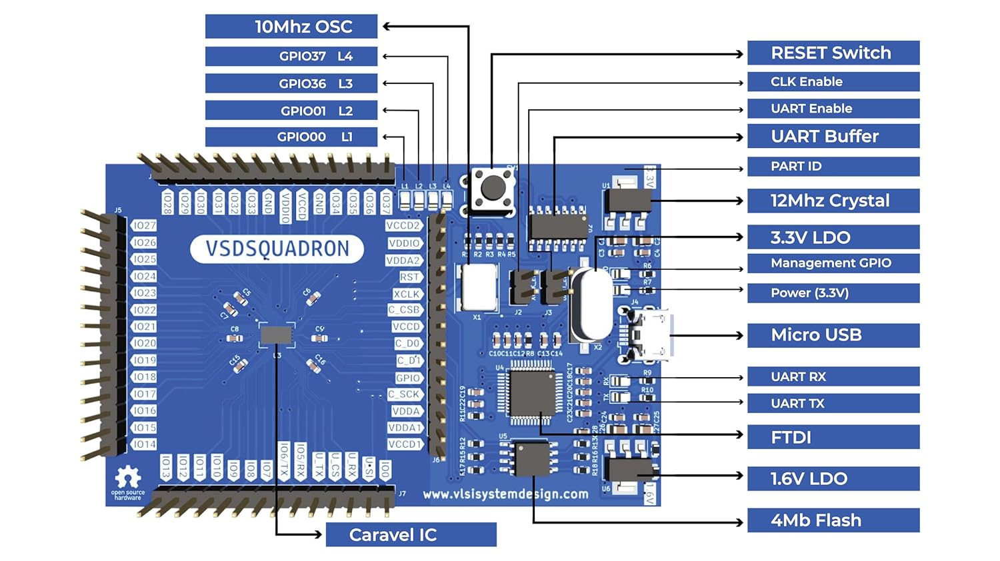
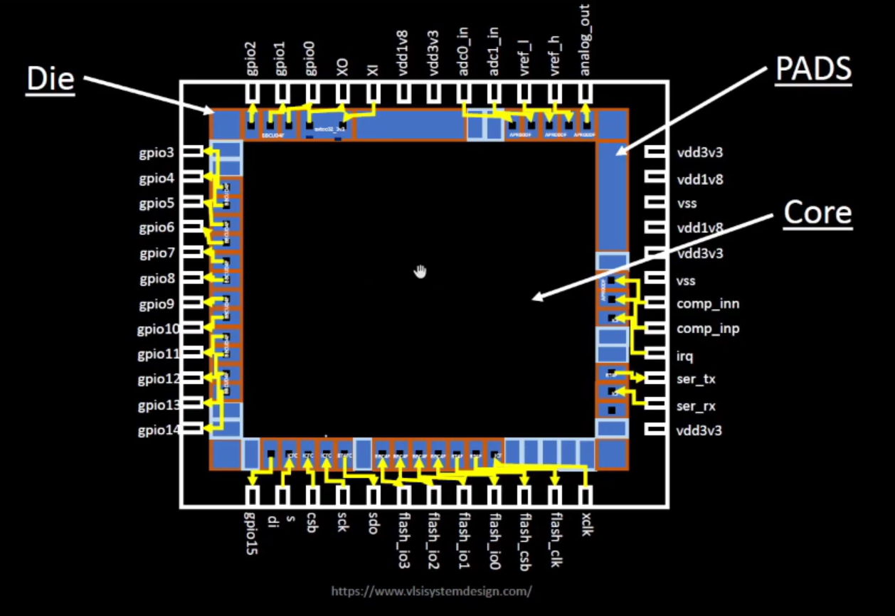
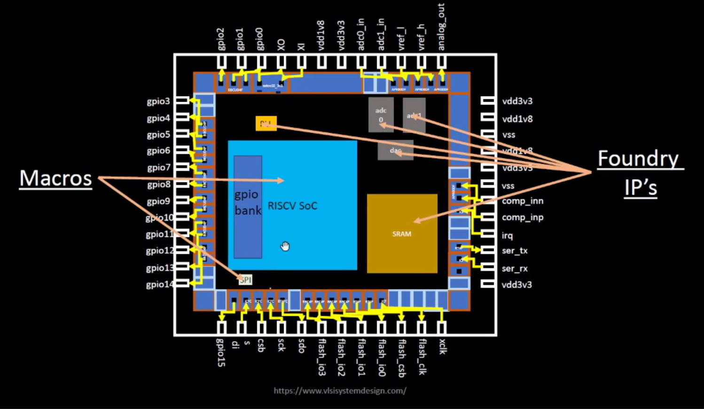
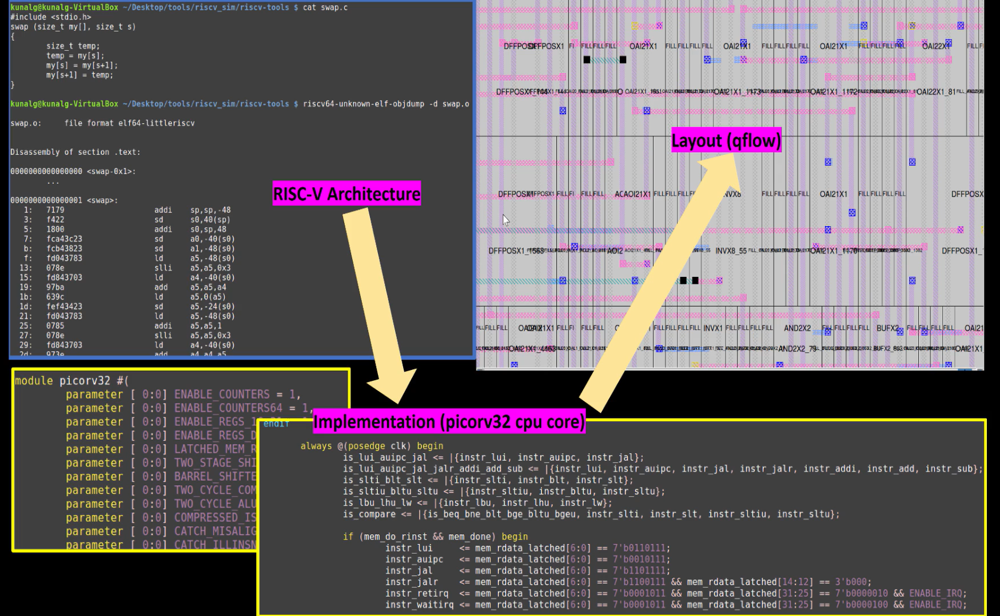

<p align="center">


# *Digital VLSI SoC Design and Planning*
Welcome to the OpenLane workshop! In this workshop, we will delve into the process of designing an Application Specific Integrated Circuit (ASIC) from the Register Transfer Level (RTL) to the Graphical Data System (GDS) file using the OpenLane ASIC flow. The flow is composed of several key steps, starting with an RTL file and culminating in a GDS file.

## Inception of open-source EDA, OpenLANE and sky130 PDK
### Overview of QFN-48 Chip, Pads, Core, Die, and IPs
**VSDSquadron** is a cutting-edge development board based on the RISC-V architecture that is fully open-source.This board presents an exceptional opportunity for individuals to learn about RISC-V and VLSI chip design utilizing only open-source tools, starting from the RTL and extending all the way to the GDSII. The possibilities for learning and advancement with this technology are limitless.RISC-V chips on these boards should be open for VLSI chip design learning, allowing you to explore Place&Route (PNR), standard cells, and layout design. The Caravel IC is a microprocessor chip that interfaces with other components on the board. The design of this chip, from the abstract level down to fabrication, is accomplished through the RTL-to-GDSII flow. The VSDsquadron consists of both a physical programmable circuit board (often referred to as a microcontroller) and software, or an IDE (Integrated Development Environment), that runs on a computer and is used to write and upload code to the physical board.

### Introduction to IC Design components

1. **Die:**
    - The die is the actual silicon wafer where all the components of the IC are fabricated.
    - It serves as the substrate that houses the functional blocks (e.g., processor cores, memory, peripherals) interconnected by metal layers.
2. **Pads:**
    - Pads are metal contact points placed along the perimeter of the die.
    - **Purpose:**
      - Provide connections for power (`vdd3v3`, `vdd1v8`, `vss`) to ensure the IC operates correctly.
      - Enable communication of signals between the IC and external components through input/output pins (`gpio`, `ser_tx`, `ser_rx`, etc.).
    - **Types of Pads:**
      - **Power Pads:** Supply voltage levels (`vdd1v8`, `vdd3v3`) and ground connections (`vss`).
      - **Signal Pads:** Interface for general-purpose inputs/outputs (`gpio`), analog signals (`adc_in`, `analog_out`), and serial communication (`ser_tx`, `ser_rx`).
3. **Core:**
    - The core is the central area of the die, where the main functional logic is implemented.
    - It contains all the key circuits, including the processor core, memory, and other peripherals.
    - Signals from the core are routed to the pads for communication with external devices.


1. **Macros:**
    - Macros are reusable, pre-designed blocks of functionality integrated into the chip.
    - These include:
      - **RISC-V SoC:** A RISC-V-based System-on-Chip (SoC) that serves as the primary computational engine of the IC.
      - **GPIO Bank:** A collection of General-Purpose Input/Output pins, used for interfacing with external peripherals like LEDs, buttons, and sensors.
      - **SPI (Serial Peripheral Interface):** A high-speed serial communication protocol used to connect the IC with external devices like flash memory or sensors.
2. **Foundry IPs:**
    - Foundry IPs are pre-designed, verified modules provided by the semiconductor foundry (the manufacturer of the chip).
    - These blocks ensure compatibility with the fabrication process and provide critical functionalities like:
      - **SRAM:** Static Random-Access Memory for storing data or instructions.
      - **ADC (Analog-to-Digital Converter):** Converts analog signals into digital values for processing.
      - **DAC (Digital-to-Analog Converter):** Converts digital data into analog signals for output.
      - 
### Introduction to RISC-V
RISC-V is an open-standard instruction set architecture (ISA) developed at the University of California, Berkeley, representing the fifth generation of RISC architecture. It is open source, fee-free, and based on established RISC principles. RISC-V supports a variety of hardware platforms and is integrated into many open-source operating systems and popular software toolchains.

The ISA is versatile, with a 32-bit fixed-length base instruction set and variable-length extensions allowing instructions to be in 16-bit increments. It supports 32-bit, 64-bit, and experimental 128-bit address space variants, though the 128-bit variant remains unfrozen due to limited practical use. Chips are connected to packages via bond wires.


This diagram demonstrates how a simple C program is executed on a RISC-V architecture by translating it into assembly code, mapping the binary representation of the assembly code, and running it on the RISC-V layout.

1 **Writing a C Program:**
- A simple C program is written to perform a specific operation (e.g., swapping two variables in memory).
  
2.**Converting to Assembly Code:**
- The C code is compiled using the RISC-V GCC toolchain to generate assembly and binary machine code.
  
3.**Executing on RISC-V Layout:**
- The binary instructions are sent to the RISC-V processor core, where the processor executes them by decoding the instructions and interacting with the hardware.
    
#### Step-by-Step Explanation
**Step 1: Writing a C Program**
A simple C program is written to demonstrate the operation. For example, the program to swap two variables is as follows:
```
c

void swap(int* myl, int* mys) {
    int temp = myl[0];
    myl[0] = mys[0];
    mys[0] = temp;
}
```
This code uses basic memory operations to swap values between two arrays.

**Step 2: Compiling to RISC-V Assembly Code**
- The C program is compiled using the RISC-V GCC toolchain:
```
bash

riscv64-unknown-elf-gcc -o swap.o swap.c
```
The compiled binary (`swap.o`) is disassembled to generate the RISC-V assembly instructions:
```
bash

riscv64-unknown-elf-objdump -d swap.o
```
The disassembled output shows the equivalent RISC-V instructions:
```
assembly

addi  a5, sp, 48
sw    a5, 0(a0)
ld    a5, 8(a0)
...
```

This step converts the high-level C code into machine-level instructions that the RISC-V processor can understand.

**Step 3: Executing on RISC-V Processor**
- The binary representation of the assembly instructions is sent to the picorv32 RISC-V processor core for execution.
- The processor core decodes and executes the instructions:
    - Registers are initialized, and memory operations (load/store) are performed as per the instructions.
    - The `always` block in the Verilog implementation of `picorv32` handles the instruction decoding and execution cycle:
```
verilog

always @(posedge clk) begin
    is_lui <= instr_lui;
    is_add <= instr_add;
    if (mem_done) begin
        instr_latched <= mem_rdata[6:0] == 7'b0110011;
    end
end
```
**Step 4: Mapping to Physical Layout**
- The Verilog design of the RISC-V core (picorv32) is synthesized into a physical layout using the qflow toolchain.
- The layout includes:
    - **Standard cells:** The building blocks of the processor.
    - **Interconnections:** Signal routing between different cells.
This layout represents the physical implementation of the RISC-V processor, where binary instructions are processed to execute the program.

# How Application Software Runs on a Laptop or Computer Package (Chip)


This diagram explains the flow of how **application software** interacts with the **hardware** of a computer or laptop, using system software to convert the program into machine-executable instructions. The entire process involves **Operating System (OS), Compiler, Assembler, and Hardware**.

---

## Step-by-Step Execution Flow

### 1. Application Software
- Application software includes programs such as:
  - **Mozilla Firefox**, **Microsoft Word**, **Acrobat Reader**, etc.
- These are user-level programs designed to perform specific tasks.

### 2. System Software
System Software acts as a bridge between **Application Software** and the **Hardware**. It comprises three main components:

#### **a) Operating System (OS)**
- Handles core tasks such as:
  - Managing Input/Output (I/O) devices,  
  - Allocating memory, and  
  - Performing low-level system operations.  
- Converts the application software into **high-level code** (e.g., written in **C**, **C++**, **Java**, or **VB**).

#### **b) Compiler**
- The **compiler** translates the high-level programming code into instructions compatible with the **Instruction Set Architecture (ISA)** of the hardware.  
- The resulting output is stored as an **.exe** file.  
- **ISA** acts as an **abstract interface** between:
  - **Software (instructions)**, and  
  - **Hardware (processor/chip)**.  
- In this case, the **RISC-V ISA** is used.

#### **c) Assembler**
- The assembler takes the compiled **.exe file** and converts it into **machine-level binary code**.  
- Binary code consists of **1s and 0s** that the hardware can understand:  
  - Example: `01000110101`, `01010010010`.

---

### 3. Hardware
- The binary instructions are sent to the **hardware** for execution.  
- The hardware (chip layout) consists of:
  - Routing paths,  
  - Data output pins (e.g., Dout1, Dout2),  
  - Clock signals (e.g., Clk Out), and  
  - Components like **DECAP1**, **DECAP2**, and more.  
- The hardware executes the instructions to **run the application software**.

---

## Key Concepts

1. **Application Software → System Software → Hardware**
   - Application software is converted into binary form and executed on hardware.

2. **RISC-V Architecture**
   - The **RISC-V ISA** determines how instructions are encoded and executed on the hardware.

3. **System Software Components**:
   - **Operating System**: Manages system-level tasks.  
   - **Compiler**: Translates high-level code to hardware-specific instructions.  
   - **Assembler**: Converts instructions into binary machine code.

4. **Instruction Set Architecture (ISA)**:
   - ISA serves as the bridge between **software instructions** and **hardware execution**.
