<p align="center">


# *Digital VLSI SoC Design and Planning*
Welcome to the OpenLane workshop! In this workshop, we will delve into the process of designing an Application Specific Integrated Circuit (ASIC) from the Register Transfer Level (RTL) to the Graphical Data System (GDS) file using the OpenLane ASIC flow. The flow is composed of several key steps, starting with an RTL file and culminating in a GDS file.

## Inception of open-source EDA, OpenLANE and sky130 PDK
### Overview of QFN-48 Chip, Pads, Core, Die, and IPs
**VSDSquadron** is a cutting-edge development board based on the RISC-V architecture that is fully open-source.This board presents an exceptional opportunity for individuals to learn about RISC-V and VLSI chip design utilizing only open-source tools, starting from the RTL and extending all the way to the GDSII. The possibilities for learning and advancement with this technology are limitless.RISC-V chips on these boards should be open for VLSI chip design learning, allowing you to explore Place&Route (PNR), standard cells, and layout design. The Caravel IC is a microprocessor chip that interfaces with other components on the board. The design of this chip, from the abstract level down to fabrication, is accomplished through the RTL-to-GDSII flow. The VSDsquadron consists of both a physical programmable circuit board (often referred to as a microcontroller) and software, or an IDE (Integrated Development Environment), that runs on a computer and is used to write and upload code to the physical board.


---

### Introduction to IC Design components

1. **Die:**
    - The die is the actual silicon wafer where all the components of the IC are fabricated.
    - It serves as the substrate that houses the functional blocks (e.g., processor cores, memory, peripherals) interconnected by metal layers.
2. **Pads:**
    - Pads are metal contact points placed along the perimeter of the die.
    - **Purpose:**
      - Provide connections for power (`vdd3v3`, `vdd1v8`, `vss`) to ensure the IC operates correctly.
      - Enable communication of signals between the IC and external components through input/output pins (`gpio`, `ser_tx`, `ser_rx`, etc.).
    - **Types of Pads:**
      - **Power Pads:** Supply voltage levels (`vdd1v8`, `vdd3v3`) and ground connections (`vss`).
      - **Signal Pads:** Interface for general-purpose inputs/outputs (`gpio`), analog signals (`adc_in`, `analog_out`), and serial communication (`ser_tx`, `ser_rx`).
3. **Core:**
    - The core is the central area of the die, where the main functional logic is implemented.
    - It contains all the key circuits, including the processor core, memory, and other peripherals.
    - Signals from the core are routed to the pads for communication with external devices.


1. **Macros:**
    - Macros are reusable, pre-designed blocks of functionality integrated into the chip.
    - These include:
      - **RISC-V SoC:** A RISC-V-based System-on-Chip (SoC) that serves as the primary computational engine of the IC.
      - **GPIO Bank:** A collection of General-Purpose Input/Output pins, used for interfacing with external peripherals like LEDs, buttons, and sensors.
      - **SPI (Serial Peripheral Interface):** A high-speed serial communication protocol used to connect the IC with external devices like flash memory or sensors.
2. **Foundry IPs:**
    - Foundry IPs are pre-designed, verified modules provided by the semiconductor foundry (the manufacturer of the chip).
    - These blocks ensure compatibility with the fabrication process and provide critical functionalities like:
      - **SRAM:** Static Random-Access Memory for storing data or instructions.
      - **ADC (Analog-to-Digital Converter):** Converts analog signals into digital values for processing.
      - **DAC (Digital-to-Analog Converter):** Converts digital data into analog signals for output.

---

### Introduction to RISC-V
RISC-V is an open-standard instruction set architecture (ISA) developed at the University of California, Berkeley, representing the fifth generation of RISC architecture. It is open source, fee-free, and based on established RISC principles. RISC-V supports a variety of hardware platforms and is integrated into many open-source operating systems and popular software toolchains.

The ISA is versatile, with a 32-bit fixed-length base instruction set and variable-length extensions allowing instructions to be in 16-bit increments. It supports 32-bit, 64-bit, and experimental 128-bit address space variants, though the 128-bit variant remains unfrozen due to limited practical use. Chips are connected to packages via bond wires.


This diagram demonstrates how a simple C program is executed on a RISC-V architecture by translating it into assembly code, mapping the binary representation of the assembly code, and running it on the RISC-V layout.

1 **Writing a C Program:**
- A simple C program is written to perform a specific operation (e.g., swapping two variables in memory).
  
2.**Converting to Assembly Code:**
- The C code is compiled using the RISC-V GCC toolchain to generate assembly and binary machine code.
  
3.**Executing on RISC-V Layout:**
- The binary instructions are sent to the RISC-V processor core, where the processor executes them by decoding the instructions and interacting with the hardware.
    
#### Step-by-Step Explanation
**Step 1: Writing a C Program**
A simple C program is written to demonstrate the operation. For example, the program to swap two variables is as follows:
```
c

void swap(int* myl, int* mys) {
    int temp = myl[0];
    myl[0] = mys[0];
    mys[0] = temp;
}
```
This code uses basic memory operations to swap values between two arrays.

**Step 2: Compiling to RISC-V Assembly Code**
- The C program is compiled using the RISC-V GCC toolchain:
```
bash

riscv64-unknown-elf-gcc -o swap.o swap.c
```
The compiled binary (`swap.o`) is disassembled to generate the RISC-V assembly instructions:
```
bash

riscv64-unknown-elf-objdump -d swap.o
```
The disassembled output shows the equivalent RISC-V instructions:
```
assembly

addi  a5, sp, 48
sw    a5, 0(a0)
ld    a5, 8(a0)
...
```

This step converts the high-level C code into machine-level instructions that the RISC-V processor can understand.

**Step 3: Executing on RISC-V Processor**
- The binary representation of the assembly instructions is sent to the picorv32 RISC-V processor core for execution.
- The processor core decodes and executes the instructions:
    - Registers are initialized, and memory operations (load/store) are performed as per the instructions.
    - The `always` block in the Verilog implementation of `picorv32` handles the instruction decoding and execution cycle:
```
verilog

always @(posedge clk) begin
    is_lui <= instr_lui;
    is_add <= instr_add;
    if (mem_done) begin
        instr_latched <= mem_rdata[6:0] == 7'b0110011;
    end
end
```
**Step 4: Mapping to Physical Layout**
- The Verilog design of the RISC-V core (picorv32) is synthesized into a physical layout using the qflow toolchain.
- The layout includes:
    - **Standard cells:** The building blocks of the processor.
    - **Interconnections:** Signal routing between different cells.
This layout represents the physical implementation of the RISC-V processor, where binary instructions are processed to execute the program.

--

## How Application Software Runs on a Laptop or Computer Package (Chip)


This diagram explains the flow of how **application software** interacts with the **hardware** of a computer or laptop, using system software to convert the program into machine-executable instructions. The entire process involves **Operating System (OS), Compiler, Assembler, and Hardware**.

---

### Step-by-Step Execution Flow

#### 1. Application Software
- Application software includes programs such as:
  - **Mozilla Firefox**, **Microsoft Word**, **Acrobat Reader**, etc.
- These are user-level programs designed to perform specific tasks.

#### 2. System Software
System Software acts as a bridge between **Application Software** and the **Hardware**. It comprises three main components:

##### **a) Operating System (OS)**
- Handles core tasks such as:
  - Managing Input/Output (I/O) devices,  
  - Allocating memory, and  
  - Performing low-level system operations.  
- Converts the application software into **high-level code** (e.g., written in **C**, **C++**, **Java**, or **VB**).

##### **b) Compiler**
- The **compiler** translates the high-level programming code into instructions compatible with the **Instruction Set Architecture (ISA)** of the hardware.  
- The resulting output is stored as an **.exe** file.  
- **ISA** acts as an **abstract interface** between:
  - **Software (instructions)**, and  
  - **Hardware (processor/chip)**.  
- In this case, the **RISC-V ISA** is used.

##### **c) Assembler**
- The assembler takes the compiled **.exe file** and converts it into **machine-level binary code**.  
- Binary code consists of **1s and 0s** that the hardware can understand:  
  - Example: `01000110101`, `01010010010`.

#### 3. Hardware
- The binary instructions are sent to the **hardware** for execution.  
- The hardware (chip layout) consists of:
  - Routing paths,  
  - Data output pins (e.g., Dout1, Dout2),  
  - Clock signals (e.g., Clk Out), and  
  - Components like **DECAP1**, **DECAP2**, and more.  
- The hardware executes the instructions to **run the application software**.

---

### Key Concepts

1. **Application Software → System Software → Hardware**
   - Application software is converted into binary form and executed on hardware.

2. **RISC-V Architecture**
   - The **RISC-V ISA** determines how instructions are encoded and executed on the hardware.

3. **System Software Components**:
   - **Operating System**: Manages system-level tasks.  
   - **Compiler**: Translates high-level code to hardware-specific instructions.  
   - **Assembler**: Converts instructions into binary machine code.

4. **Instruction Set Architecture (ISA)**:
   - ISA serves as the bridge between **software instructions** and **hardware execution**.
  
---


This diagram shows that After the instruction and assembler stages, there is another interface before the hardware: the Register Transfer Level (RTL) description written in a Hardware Description Language (HDL). This RTL is used to convert instructions into machine code, which is then synthesized into a netlist containing gates and flip-flops.

#### 1. Instruction Set Architecture (ISA)
The ISA provides an abstract interface between software and hardware. It defines operations like arithmetic, logic, and control instructions.
- **Example Instruction:**
 ```
  assembly

  add x6, x10, x6

 ```
This means:
- Add the contents of register `x10` to register `x6` and store the result back in `x6`.

#### 2. Assembler
The Assembler translates ISA instructions into binary machine code. This binary code is the input to the hardware.
- **Machine Code:**
 ```
 mechine code

 01000110101  
 0101001010  
 ```
The binary code corresponds to the operation, source registers, and destination register

#### 3. Register Transfer Level (RTL)
The RTL is written in Hardware Description Language (HDL) like Verilog or VHDL. It describes how the hardware interprets and executes the instructions.
- **Example RTL Snippet (Verilog):**
 ```
 verilog

 module picorv32 #( 
     parameter [0:0] ENABLE_COUNTERS = 1, 
     parameter [0:0] ENABLE_REGS = 1
 );

always @(posedge clk) begin
    if (instr_valid) begin
        if (instr == "ADD") begin
            regfile[instr_rd] <= regfile[instr_rs1] + regfile[instr_rs2];
        end
    end
end
```

- **Key Highlights:**
  - The RTL code performs the ADD operation.
  - Registers instr_rs1 and instr_rs2 are read and summed.
  - The result is stored back in the destination register instr_rd.

#### Netlist Generation
The RTL code is synthesized into a netlist, which describes the hardware implementation using logic gates and flip-flops.
- **Netlist Example (Simplified View):**
 ```

 Copy code
 0000000000110101001000011000011
 ```
The netlist maps the operations to actual digital components like AND gates, flip-flops, and multiplexers.

- **Diagram Representation (from the image):**
  This synthesized design connects combinational logic and sequential logic (flip-flops) to implement the ADD instruction.

----

## Soc design and OpenLANE
### Introduction to all components of open-source digital asic design
1. **Digital Asic Design**
   Designing **Application-Specific Integrated Circuits (ASICs)** in an automated way involves several essential components. These elements work together to ensure a smooth and efficient design process.

   

   1. **RTL IP's (Register Transfer Level Intellectual Property):** RTL IPs are pre-designed modules or blocks that describe the behavior and structure of digital circuits at the RTL level. They are crucial for reusability and accelerating the design process.

    3. **EDA Tools (Electronic Design Automation Tools)**:
EDA tools provide software solutions for designing, verifying, and implementing ASICs. These tools handle various design stages, including synthesis, simulation, place-and-route, and timing analysis.

    4. **PDK DATA (Process Design Kit Data)**
PDKs contain all the process-specific information, including libraries, models, and layout rules, required to design ASICs for a particular semiconductor technology node. They ensure compatibility with the fabrication process.

3. **Open Source Digital ASIC Design**
   Designing an **Application-Specific Integrated Circuit (ASIC)** has traditionally been a costly and complex process, making it inaccessible for many. However, with advancements in **open-source tools** and resources, the dream of creating a fully functional ASIC has now become a reality.
   
   

    #### 1. RTL Designs:
    - RTL (Register Transfer Level) designs define the digital logic functionality of the ASIC.
    - Open-source platforms like:
      - librecores.org
      - opencores.org
      - github.com
      provide readily available RTL IPs for various applications.

    #### 2. EDA Tools (Electronic Design Automation Tools):
   - Open-source EDA tools help automate the ASIC design process, including synthesis, place-and-route, and timing analysis.
    - Popular tools include:
      - QFlow
      - OpenROAD
      - OpenLANE

    #### 3. PDK Data (Process Design Kit Data):
   - PDKs contain the process-specific libraries, layout rules, and models required for ASIC fabrication.
    - An example is the SkyWater 130nm PDK made available in collaboration with Google.
      - SkyWater PDK GitHub Repository

### Simplified RTL to GDSII Flow

The RTL to GDSII flow is a step-by-step process used in the semiconductor industry to transform a Register Transfer Level (RTL) design into a final GDSII layout, which can be used for chip manufacturing. 


    
#### Flow Steps
1. **Synthesis (Synth)**
The RTL design is converted into a gate-level netlist using a synthesis tool. This step maps the design to a specific technology library, ensuring it meets the desired timing, area, and power constraints.

2. **Floorplanning and Power Planning (FP+PP)**
The chip layout is defined at a high level. Key areas, such as cores and blocks, are positioned, and power distribution is planned to ensure reliable operation.

3. **Placement (Place)**
Standard cells are placed in the predefined floorplan locations. The placement tool optimizes the design for timing and minimizes wirelength.

4. **Clock Tree Synthesis (CTS)**
A clock distribution network is created to deliver a synchronized clock signal across the entire design while minimizing skew and ensuring proper timing.

5. **Routing (Route)**
The interconnections between cells and blocks are routed. This step ensures all signals are correctly connected and meets the timing, power, and design rule constraints.

6. **Sign-Off**
The final design is verified against manufacturing and performance requirements. Checks include timing analysis, design rule checking (DRC), and layout versus schematic (LVS) comparison.

#### Inputs and Outputs
- **Inputs:**
    - **RTL:** The design description in a high-level hardware description language (HDL), such as Verilog or VHDL.
    - **PDK:** The Process Design Kit containing the technology-specific information required for the design.
- **Outputs:**
  - **GDSII:** The final layout format used for fabrication.
 
---
### Introduction to OpenLANE and Strive chipsets

With the release of the open-source PDK at eFabless, it will drive the creation of its own reference open-source ASIC implementation methodology called **OpenLane**. 

#### Open Source ASIC Flow Challenges 

Using open-source EDA tools for ASIC design presents unique challenges compared to commercial solutions. The key issues include **tools qualification**, where open-source tools may lack formal validation for production use, **tools calibration**, which requires manual tuning to match process node specifications, and **missing tools**, as some essential features like advanced DRC, LVS, or power analysis may not be fully available. While OpenLane is a promising step forward, addressing these challenges is crucial to achieving industry-grade reliability and efficiency.

#### OpenLane and striVe: Open-Source ASIC Innovation

**OpenLane** started as an **open-source ASIC design flow** aimed at enabling a **true open-source tape-out experiment**. It provides a complete methodology for RTL-to-GDSII implementation using open-source tools and the SkyWater 130nm process.  

Additionally, **striVe** is a family of **open-everything SoCs**, built entirely on **open PDKs, open EDA tools, and open RTL designs**. This initiative demonstrates the feasibility of a fully open-source semiconductor design ecosystem.  
<p align="left">
    
    
</p>
The image illustrates a **striVe SoC block diagram**, detailing its components such as the **RISC-V core, SRAM, SPI interface, PLL, and GPIOs**, along with a **GDSII layout representation** of the finalized ASIC. This showcases the **practical application of OpenLane in real silicon tape-outs**.

#### striVe SoC Family

The **striVe SoC family** is a set of **open-source System-on-Chip (SoC) designs** created using **OpenLane** and the **SkyWater 130nm PDK**. These designs serve as **reference implementations** for open-source ASIC development.  

1. **Key Highlights**  
- Developed as **open-source SoCs** for research, prototyping, and education.  
- Uses **OpenLane**, an open-source ASIC flow, for RTL-to-GDSII implementation.  
- Built on the **SkyWater 130nm process**, supported by Google and eFabless.  
- Demonstrates **different memory architectures**, including synthesized SRAM and OpenRAM.  
- Aims to **make ASIC design accessible** to the wider hardware community.  

2. **striVe SoC Variants and Features**  

| **SoC Variant** | **Technology Node** | **Memory Architecture** | **Special Features** |  
|---------------|-----------------|---------------------|----------------|  
| **striVe**   | Sky130 SCL       | Synthesized 1 KByte SRAM | Baseline variant |  
| **striVe 2** | Sky130 SCL       | 1 KByte OpenRAM block | Uses OpenRAM instead of synthesized SRAM |  
| **striVe 2a** | Sky130 SCL       | Same as striVe 2 | Single-chip core module |  
| **striVe 3** | OSU SCL          | Synthesized 1 KByte SRAM | Uses OSU Standard Cell Library |  
| **striVe 5** | Sky130 SCL       | 8 × 1 KByte OpenRAM banks | Higher memory capacity |  
| **striVe 6** | Sky130 SCL       | Same as striVe 2 | Includes Design for Testability (DFT) |  

3. **Supported by Open-Source Silicon Community**  
- **SkyWater** – Provides open-source **PDK**.  
- **Google** – Supports open ASIC initiatives.  
- **OpenROAD** – Contributes open EDA tools.  
- **eFabless** – Enables open-source chip manufacturing.

#### OpenLANE ASIC Flow

1. **Goal**

    The main objective of OpenLANE is to **produce a clean GDSII file with no human intervention** (also known as **no-human-in-the-loop** automation). This means that the generated layout should meet all verification requirements without manual fixes.

2. **Clean GDSII Requirements:**
    - **No LVS (Layout vs. Schematic) Violations**
    - **No DRC (Design Rule Check) Violations**
    - **Timing Violations**: Work in progress (WIP)

3. **PDK Support**
OpenLANE is primarily **tuned for the SkyWater 130nm Open PDK** but also supports other process design kits:
    - **SkyWater 130nm Open PDK**
    - **XFAB180**
    - **GF130G**


4. **Containerized Flow**
To ensure a smooth and reproducible experience, OpenLANE is **containerized**, meaning:
    - It works **out of the box** without requiring complex dependencies.
    - Instructions for building and running it natively will be provided.

5. **Features**  

    1. **Tuned for SkyWater 130nm Open PDK**  
        - OpenLANE is optimized for the **SkyWater 130nm** open-source **Process Design Kit (PDK)**.  
        - This means that the toolchain is specifically set up to generate designs that can be **fabricated using SkyWater’s 130nm technology node**.  
        - The 130nm process is widely used in research and open-source silicon projects due to its balance of performance, power, and cost-effectiveness.  

    2. **Support for Multiple PDKs**  
    - In addition to **SkyWater 130nm**, OpenLANE also supports:  
      - **XFAB180** – An **180nm** PDK, often used for mixed-signal and analog ICs.  
      - **GF130G** – A **130nm** PDK from **GlobalFoundries**, providing an alternative fabrication option.  
    - The ability to work with multiple PDKs gives designers more flexibility when choosing a manufacturing process.  

    3. **Containerized Implementation**  
        - OpenLANE is packaged as a **Docker container**, which allows for **quick and easy deployment** across different systems.  
        - Benefits of using a containerized approach:  
          - **No manual installation hassles** – The entire toolchain is bundled and pre-configured.  
          - **Cross-platform support** – Works on **Linux, macOS, and Windows** with minimal setup.  
          - **Consistent Environment** – Ensures the same configurations and dependencies across different users.  
        - In the future, **instructions for native (non-containerized) builds** will be provided for users who prefer to install the tools directly.  

    4. **Can Be Used to Harden Macros and Chips**  
        - **Hardening** refers to converting a **soft macro** (a high-level digital design in Verilog) into a **physical layout** that can be fabricated.  
        - OpenLANE supports hardening **both individual IP blocks (macros) and complete chips**, making it useful for various design scales.  

    5. **Two Modes of Operation**  
        1. **Autonomous Mode** 🛠️  
           - Runs automatically using **default settings** and pre-configured design flows.  
           - Ideal for **quick prototyping** or users who prefer an automated workflow.  
        2. **Interactive Mode**
           - Allows users to **manually adjust** settings at different stages of the ASIC design process.  
           - Useful for **fine-tuning designs** based on specific constraints like power, performance, or area (PPA).  

    6. **Design Space Exploration (DSE)**  
        - **DSE helps find the best set of tool configurations** to optimize the design.  
        - It systematically explores different options to **improve power, performance, and area (PPA)**.  
        - This is especially useful for achieving the best trade-offs when working with different design constraints.  

    7. **Large Number of Design Examples**  
        - OpenLANE includes **43 pre-verified design examples**, each showcasing different capabilities and best practices.  
        - These examples help new users **learn faster** by providing ready-to-use test cases.  
        - **More designs will be added soon**, expanding the available resources for learning and experimentation.  
---

### Introduction to OpenLANE detailed ASIC design flow

#### Overview  
OpenLane is an open-source toolchain for **ASIC physical design automation** (RTL-to-GDSII) targeting **open PDKs** like **SkyWater 130nm**. It integrates multiple open-source tools for synthesis, placement, routing, and verification.  

The following diagram illustrates the **OpenLane Flow**, which converts an RTL description into a **manufacturable layout**:  

  

#### OpenLane Flow Explanation  

1. **RTL Synthesis and Static Timing Analysis (STA)**
    1. **RTL Synthesis** (using **Yosys + ABC**) converts the Verilog RTL design into a **gate-level netlist**.  
    2. **Static Timing Analysis (STA)** (using **OpenSTA**) checks the timing constraints of the generated netlist.  
    3. **Synthesis Exploration** is an optional feature that evaluates different synthesis strategies:  
    - OpenLane provides **four default synthesis strategies** to explore different **area-delay trade-offs**.  
    - Users can also define their **own custom synthesis strategies**.  
    4. STA results are **visualized graphically** on an **HTML dashboard** for further analysis.  

2. **Insertion of Design-for-Testability (DFT) Structures**
    - The **Fault** tool can optionally **insert scan chains** and **test IO ports** into the synthesized netlist.  
    - This step ensures that the fabricated chip can be **tested effectively** after manufacturing.  
    - A variant of **strIve chips** includes DFT structures for better OpenLane integration.  

3. **Physical Implementation**
    - **Floorplanning & Placement:** The design undergoes **floorplanning** (defining chip layout), **placement**, and **clock tree synthesis (CTS)** using **OpenROAD**.  
    - **Optimization:** Post-placement optimization is performed using **OpenPhySyn**.  
    - **Diode Insertion:** To prevent **antenna effects**, **custom scripts** insert diodes in the layout.  
    - **Logic Equivalence Check (LEC)** (using **Yosys**) verifies that **post-optimization netlists** are functionally equivalent to the original synthesized netlist.  
    - **I/O Pin Placement Modes:**  
       - **Default Mode:** Uses **OpenROAD** for automatic pin placement.  
       - **Custom Mode:** Allows manual pin placement for **full control over pin locations**.  
       - **Contextualized Mode:** Automatically optimizes I/O placement **based on SoC integration requirements**.  
    - The final output of this stage is a **routed DEF** (Design Exchange Format file), ready for evaluation.  

4. **Post-Routing Evaluation & Verification**
    - **Design Rule Check (DRC)** and **Layout-vs-Schematic (LVS)** verification are performed using **magic** and **netgen**.  
    - **Antenna Rule Check (ARC)** is conducted using either **OpenROAD’s ARC tool** or **magic**.  
    - **RC Extraction:** Extraction of **parasitic resistances and capacitances** using **SPEF EXTRACTOR**.  
    - **Final STA Analysis:** Another round of **static timing analysis** is performed to generate **accurate timing reports** for the **physical layout**.  

**Final Output: GDSII and LEF Files**
The final output of the OpenLane flow includes:  
    - **GDSII File:** Standard format for sending designs to **fabrication**.  
    - **LEF File:** Layout Exchange Format file used for integration into **larger designs**.  

#### OpenLane Design Exploration and Regression Testing

1. **Synthesis Exploration**  
Synthesis exploration involves analyzing different synthesis strategies to optimize area, power, and timing of digital designs.  
    - The scatter plot displays the trade-off between **area** (measured in μm²) and **delay** (measured in ps).  
    - Each point represents a synthesis strategy (S1 to S8), where:  
      - **Lower area** is preferred for cost reduction.  
      - **Lower delay** is preferred for better performance.  
      - The ideal synthesis strategy minimizes both area and delay.  

2. **Design Exploration**  
Design exploration is used to compare different placement and routing strategies to find the best configuration for the design.  
    - The table presents various design configurations, including:  
      - **Design Name**: The name of the circuit being synthesized (e.g., AES, CORDIC).  
      - **Runtime**: Total execution time for the flow.  
      - **Cell Count**: Number of standard cells in the design.  
      - **TR Vios (Timing Rule Violations)**: Indicates how many timing constraints were violated.  
      - **FP_CORE_UTIL**: Floorplan core utilization percentage.  
      - **Routing Strategy**: The approach used for routing.  
      - **GLB_RT_ADJUSTMENT**: A global routing parameter affecting congestion and optimization.  

3. **OpenLane Regression Testing**  
Regression testing ensures the OpenLane flow remains stable and produces consistent results across multiple designs.  
    - The table lists results for ~70 designs, comparing current runs to previously known best runs.  
      - **JPEG Encoder, AES, TEA, CPU, etc.**: These are benchmark designs tested in OpenLane.  
      - **Runtime**: How long each design takes to complete the OpenLane flow.  
      - **Cell Count**: The number of logic cells in the design.  
      - **TR Vios (Timing Violations)**: Ideally, should be zero, indicating no violations.  
      - Green shading indicates successful designs with zero violations.  

#### **Design for Test (DFT)**  

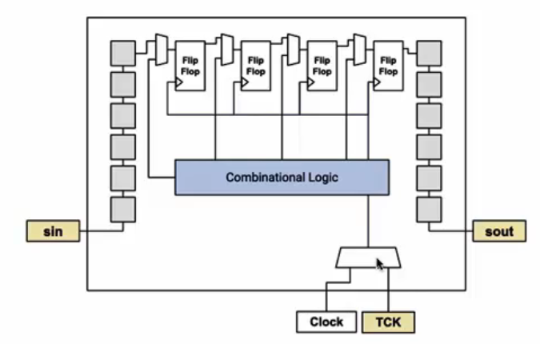  

Design for Test (DFT) is a methodology used in digital circuit design to enhance testability, ensuring defects can be detected efficiently during manufacturing.  

1. **Key DFT Techniques**  
    1. **Scan Insertion**  
       - Converts flip-flops into scan-enabled flip-flops, forming a scan chain.  
       - Facilitates controlled testing by shifting test patterns in and out.  

    2. **Automatic Test Pattern Generation (ATPG)**  
       - Generates test vectors to maximize fault detection.  
       - Reduces the need for manual test pattern creation.  

    3. **Test Patterns Compaction**  
       - Reduces the number of test vectors while maintaining fault coverage.  
       - Optimizes test time and memory usage.  

    4. **Fault Coverage**  
       - Measures how many faults can be detected using a given test pattern.  
       - Higher fault coverage ensures better defect detection.  

    5. **Fault Simulation**  
       - Simulates circuit behavior with faults to validate the effectiveness of test patterns.  
       - Helps assess how well the design can be tested in real-world scenarios.  

2. **DFT Block Diagram Explanation**  
The diagram illustrates a **scan-based DFT architecture**, where:  
    - **Flip-flops** are connected in a scan chain to enable shift operations.  
    - **Combinational Logic** is tested by applying and capturing test patterns.  
    - **sin (scan-in) & sout (scan-out)** are used to load and read test patterns.  
    - **Clock & TCK (Test Clock)** control the scan shifting process.  


#### **Physical Implementation (PnR)**  

**Physical Implementation** is the process of converting a synthesized netlist into a fully placed and routed layout that meets design constraints. It is also referred to as **Place and Route (PnR)** and is an automated process handled by tools like **OpenROAD**.  

1. **Key Steps in Physical Implementation**  
    1. **Floor & Power Planning**  
       - Defines chip dimensions and block placements.  
       - Allocates power rails to ensure proper power distribution.  

    2. **Decoupling Capacitor & Tap Cell Insertion**  
       - **Decoupling Capacitors:** Help reduce noise and voltage fluctuations.  
       - **Tap Cells:** Ensure well connections to prevent latch-up issues.  

3. **Placement (Global & Detailed)**  
       - **Global Placement:** Determines approximate locations of cells.  
       - **Detailed Placement:** Optimizes locations considering legal placement rules.  

4. **Post-Placement Optimization**  
       - Refines placement to improve **timing, power, and area (PPA)**.  
       - Resolves congestion issues.  

5. **Clock Tree Synthesis (CTS)**  
       - Ensures balanced clock distribution across the design.  
       - Minimizes **clock skew and insertion delay**.  

6. **Routing (Global & Detailed)**  
       - **Global Routing:** Plans routing paths without specific layer assignments.  
       - **Detailed Routing:** Assigns specific metal layers and ensures **Design Rule Check (DRC)** compliance.

#### **Logic Equivalence Check (LEC)**  

**Logic Equivalence Check (LEC)** is a formal verification process used to ensure that modifications to a netlist do not alter its intended functionality.  

1. **Why LEC is Required?**  
During the **physical implementation** phase, certain modifications occur:  
    - **Clock Tree Synthesis (CTS):** Adjusts the netlist to balance clock distribution.  
    - **Post-Placement Optimization:** Further modifies the netlist to improve **timing, area, and power**.  

These changes can potentially introduce functional mismatches. LEC verifies that the logical behavior remains **unchanged**.  

2. **How LEC Works?**  
    1. **Compares Pre- and Post-Modified Netlists:**  
       - Takes the original synthesized netlist as a reference.  
       - Compares it against the netlist after **CTS or placement optimizations**.  
    2. **Formal Verification:**  
       - Uses mathematical proofs to confirm **functional equivalence**.  
       - Ensures that optimizations did not introduce unintended logic changes.  

3. **LEC Tools**  
- **Yosys** (Open-source tool for logic synthesis and verification).  
- Industry-standard tools like **Conformal LEC** (Cadence) and **FormalPro** (Siemens EDA).  

#### Dealing with Antenna Rules Violations

1. **Overview**
During the fabrication of integrated circuits, metal wire segments can act as antennas, accumulating charge due to reactive ion etching. This accumulated charge can lead to transistor gate damage. To mitigate this issue, certain design rules and solutions are implemented.

2. **Causes of Antenna Violations**
    - When a metal wire segment is fabricated, it can function as an antenna.
    - Reactive ion etching causes charge to accumulate on the wire.
    - If not properly handled, this charge can lead to damage in transistor gates during fabrication.
      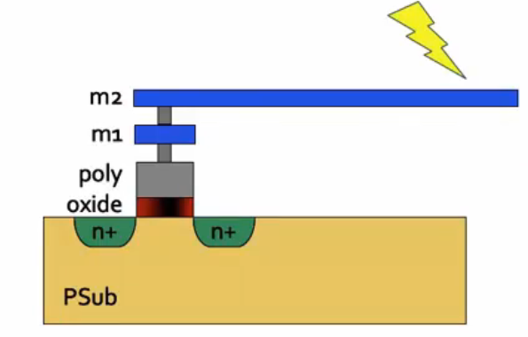  

3. **Solutions to Antenna Violations**
Two primary methods are used to address antenna rule violations:

    1. **Bridging**
       - Attaches a higher-layer intermediary to distribute charge buildup.
       - Requires router awareness (not fully automated in all tools yet).

         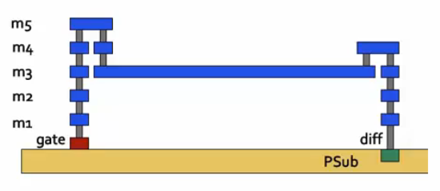 

    2. **Antenna Diode Cells**
       - Special diodes are added to leak away excess charge.
       - Provided by the standard cell library (SCL) to prevent damage.
      
         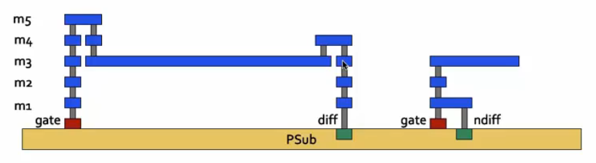  

4. **Preventive Approach**
To further mitigate antenna violations, a preventive design strategy is followed:
    - **Fake Antenna Diode Placement:** A fake antenna diode is placed next to every cell input after placement.
    - **Antenna Checker (Magic) Execution:** The design layout is analyzed for potential violations.
    - **Replacement of Fake Diodes:** If the checker detects a violation, the fake diode is replaced with a real antenna diode cell.
      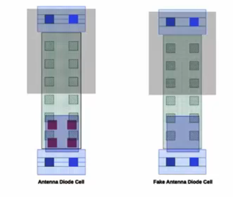  

#### Static Timing Analysis (STA)

1. **Overview**
Static Timing Analysis (STA) is a method used to verify the timing of a digital circuit without requiring simulation. It ensures that all timing constraints are met by analyzing the delay of paths in the design.

2. **Tools Used**
    - **RC Extraction:** `DEF2SPEF` is used to extract resistance and capacitance values from the design.
    - **STA:** `OpenSTA` (part of the OpenROAD project) is used for performing static timing analysis.

3. **Example Timing Report**
The image shows an example timing analysis report generated using OpenSTA. The report includes:
    - **Startpoint & Endpoint:** Defines the beginning and end of the timing path.
    - **Path Type:** Specifies whether it's a setup or hold timing check.
    - **Delay Breakdown:** Displays individual delays at different stages of the path.
    - **Slack Calculation:** Computes the slack value, which determines if the design meets timing requirements. A positive slack indicates timing is met (MET), while a negative slack indicates a violation.

Here's a README section describing the content of the image:

#### Physical Verification: DRC & LVS

1. **Overview**
Physical verification ensures that the designed layout follows manufacturing rules and matches the intended circuit functionality. This process includes **Design Rule Checking (DRC)** and **Layout vs. Schematic (LVS) verification**.

2. **Tools Used**
    - **Magic**: A VLSI layout tool used for:
      - **Design Rule Checking (DRC)** to ensure the layout meets fabrication constraints.
      - **SPICE extraction** from the layout for circuit simulations.
    - **Netgen**: A tool used for **Layout vs. Schematic (LVS) verification** by comparing:
      - The **SPICE netlist extracted by Magic** from the layout.
      - The **Verilog netlist** to ensure both representations match.

3. **Importance of Physical Verification**
    - **DRC ensures manufacturability**, preventing layout errors that violate fabrication constraints.
    - **LVS ensures correctness**, verifying that the physical layout corresponds to the intended circuit design.

By using **Magic** and **Netgen**, designers can validate their layouts before fabrication, reducing errors and ensuring correct functionality.

---

### Design Preparation Step

#### Prerequisites
- Docker installed and configured
- OpenLANE repository cloned
- Required PDKs (e.g., Sky130) available

#### Initial Setup

<p align="left">
    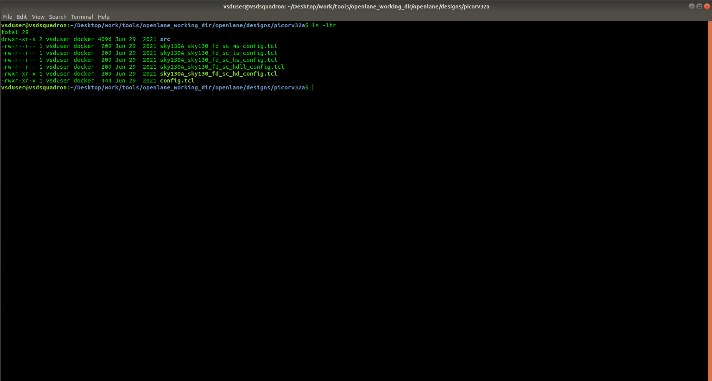
    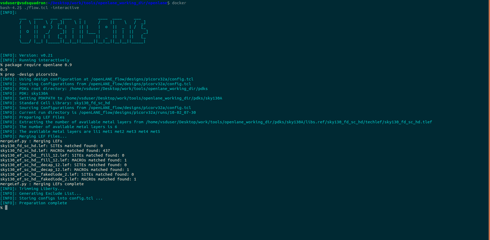
</p>

1. **Configure `config.tcl`**
Before running the OpenLANE flow, ensure the `config.tcl` script is correctly set up with:
- Verilog source file locations
- Library (.lib) files for standard cells
- Layout Exchange Format (.lef) files for physical design

These files are essential for synthesis, placement, and routing.

2. **Start OpenLANE in Interactive Mode**
Run the following command from the OpenLANE directory:
```sh
./flow.tcl -interactive
 ```
This will launch OpenLANE in interactive mode, setting up all required tools with default configurations.

3. **Prepare the Design Environment**
Once inside the interactive session, configure the design name and database folder where results, logs, and error reports will be stored for the current run.
```sh
prep -design <design_name>
```
Example:
```sh
prep -design picorv32a
```
This step ensures the setup of necessary files and directories before proceeding with further ASIC flow steps.

Here's a section you can add to your GitHub README file:  

#### Review files after design prep and run synthesis

Once the preparation process is complete, a new directory will be automatically generated within the `runs` folder. This directory will be named based on the current date and will contain all the necessary subdirectories for storing various results, reports, and intermediate files.  

<p align="left">
    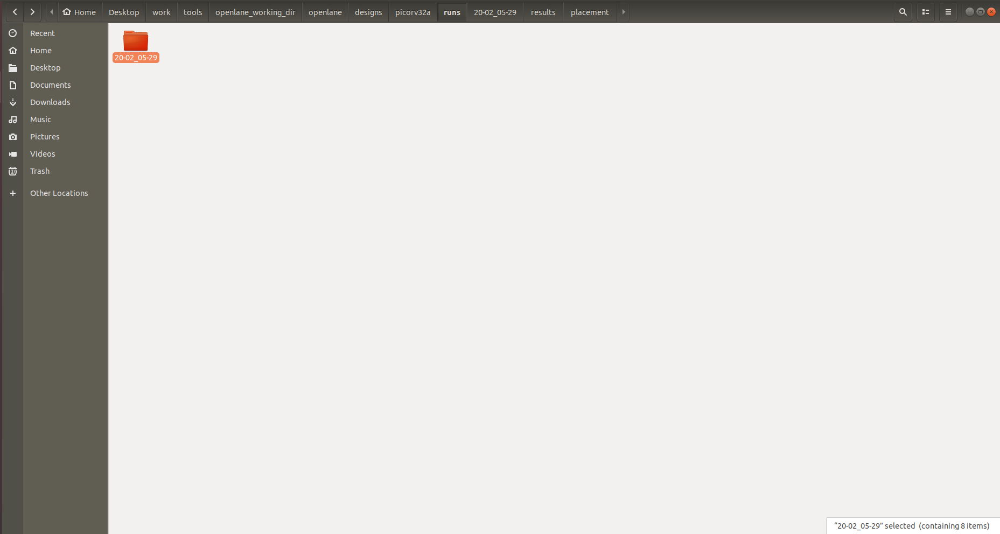
    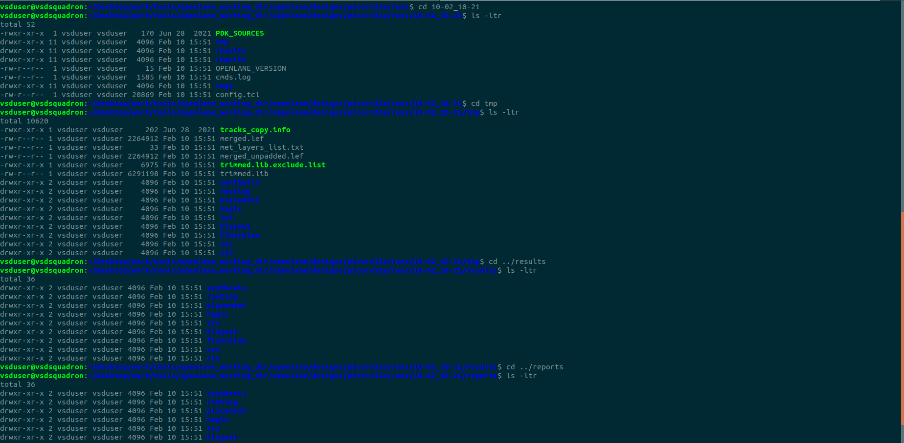
</p>


1. **Example Directory Structure**

```
runs/
  ├── 10-02_10-21/      # Auto-generated folder (based on date)
      ├── results/      # Contains synthesis, placement, routing, etc.
      ├── reports/      # Stores detailed reports on each stage
      ├── tmp/          # Temporary files used during execution
      ├── PDK_SOURCES/  # Process design kit sources
      ├── config.tcl    # Configuration file for the run
      ├── cmds.log      # Logs of executed commands
```

2. **Explanation**

- **`results/`**: Contains the outputs from synthesis, placement, routing, and other stages.  
- **`reports/`**: Stores textual reports detailing each design step.  
- **`tmp/`**: Holds temporary files created during the run.  
- **`PDK_SOURCES/`**: Includes references to the process design kit used.  
- **`config.tcl`**: The configuration file used for the execution.  
- **`cmds.log`**: A log file that records all executed commands.  

#### OpenLANE Synthesis Process

1. **Overview**
This document describes the synthesis process in OpenLANE, which involves converting a high-level Verilog design into a gate-level netlist mapped to a standard cell library. The synthesis is performed using tools like `yosys` for logic synthesis, `abc` for technology mapping and optimization, and `OpenSTA` for static timing analysis.


2. **Steps in the Synthesis Process**

    1. **Running Synthesis**
    To perform synthesis, we provide the following files:
        - **Liberty files**: Defines the standard cell library characteristics.
        - **Verilog files**: The design files that need to be synthesized.
        - **SDC files**: Constraints such as clock period and timing requirements.

    In OpenLANE, once these files are specified in the configuration script, we initiate synthesis using the command:
    ```bash
    run_synthesis
    ```
    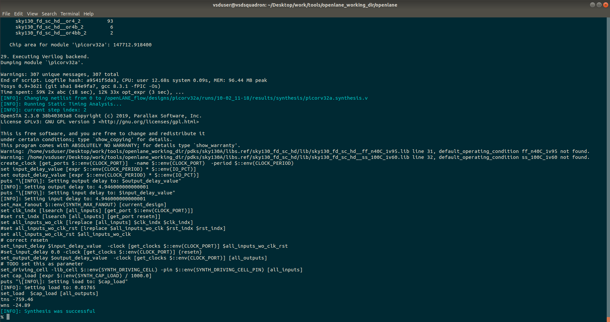

    2. **Gate Mapping and Optimization**
    After synthesis, the `abc` tool maps the logic to available standard cells in the library and optimizes the generated netlist. The process includes:
        - Mapping logic to gates.
        - Optimizing for area and performance.
        - Reducing redundant logic.

    3. **Flip-Flop Ratio Calculation**
    One of the key metrics in synthesis is the **flip-flop ratio**, which is calculated as:
    ```math
    Flop Ratio = (Number of D Flip-Flops) / (Total Number of Cells)
    ```
    The flop ratio is useful for analyzing sequential-to-combinational logic balance. The calculation is illustrated below:

    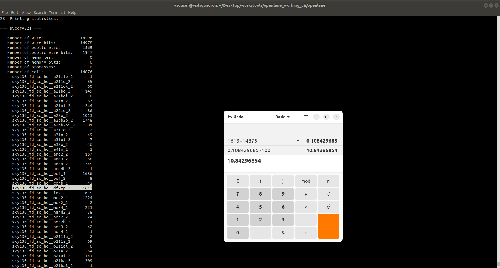

    In this example:
        - **Number of D Flip-Flops** = 1613
        - **Total Number of Cells** = 14876
        - **Flop Ratio** = 10.84%

    4. **Timing Analysis**
    Once synthesis is completed, OpenSTA (Open Static Timing Analyzer) is invoked to perform static timing analysis (STA). This step ensures that the design meets the         required timing constraints, as shown in the timing report:

    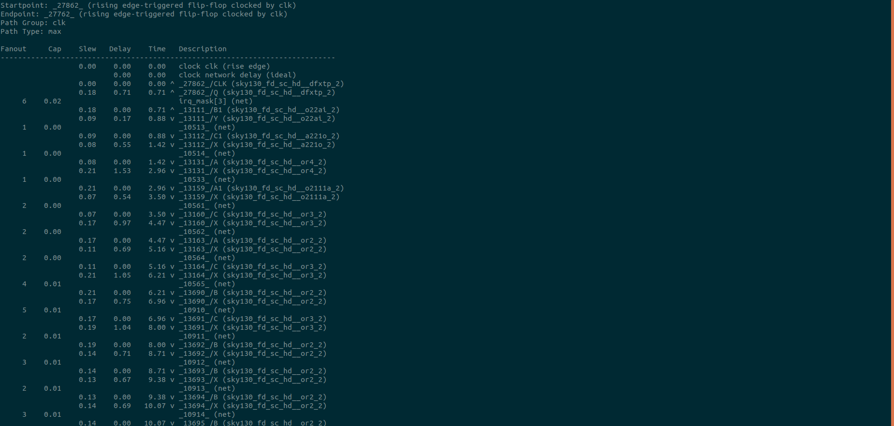

    The report includes:
    - **Clock network delay**
    - **Path delays**
    - **Setup and hold timing violations**
   
---
## Good floorplan vs bad floorplan and introduction to library cells
### Chip Floor planning considerations
#### Floorplanning in ASIC Flow
1. **Overview**
Floorplanning is a crucial step in the ASIC design flow, determining the placement of various components on the chip. It ensures optimal area utilization, efficient power distribution, and proper connectivity.

2. **Key Aspects of Floorplanning**
    1. **Die and Core Utilization Ratios, Aspect Ratio**
        - **Die Area:** The total area available on the silicon wafer.
        - **Core Area:** The part of the die where standard cells and macros are placed.
        - **Utilization Ratio:** The percentage of the core area occupied by standard cells and macros.
        - **Aspect Ratio:** Defines the shape of the die (square or rectangular).

    2. **Pin Placement**
        - IO pins (input and output pins) are placed along the periphery of the die.
        - Proper pin placement affects routing complexity and timing performance.

    3. **Power Planning**
        - Power stripes and rings are added to distribute power efficiently across the chip.
        - Ensures that all cells receive stable power and reduces IR drop issues.

    4. **Placement of Physical Cells**
        - Physical cells like decoupling capacitors, well taps, and fillers are placed to ensure correct power and signal integrity.

    5. **Placing of Blockages**
        - Blockages prevent certain areas from being occupied by standard cells.
        - Useful for ensuring clearances for macros, power distribution, and congestion reduction.

3. **Floorplanning in OpenLANE Flow**

    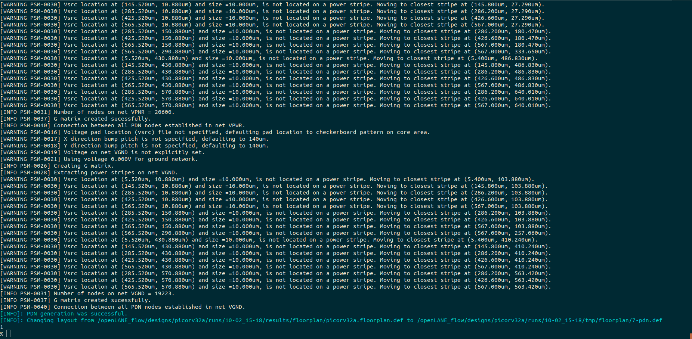
   
    - OpenLANE automates much of the floorplanning process.
    - **Die and core utilization ratios, aspect ratio** are set in the `configs` file.
    - The `run_floorplan` command is used to execute the floorplanning step.
    - **IO pins, physical cells, and blockages** are placed automatically.


4. **Understanding the DEF File:**

    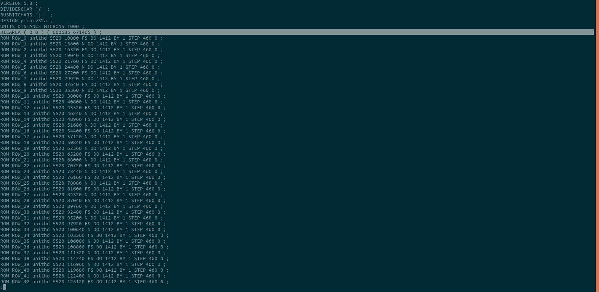
   
    1. **VERSION 5.8:**  
       - Indicates the DEF file version used.

    2. **DIVIDERCHAR "/" & BUSBITCHARS "[]"**  
       - Specifies the characters used to separate hierarchical design elements and define bus structures.

    3. **DESIGN picorv32a:**  
       - The name of the design, in this case, `picorv32a`.

    4. **UNITS DISTANCE MICRONS 1000:**  
       - The unit of measurement for placement coordinates, meaning 1 unit = 1 micron.

    5. **DIEAREA ( 0 0 ) ( 660685 671405 ):**  
       - Defines the **physical boundary** of the die.  
       - The lower-left corner of the die is at `(0,0)`, and the upper-right corner is at `(660685,671405)` (in microns).

5 **Standard Cell Rows:**
- The **ROWS** define the placement grid for standard cells. Each row follows this format:  

  ```
  ROW <name> <site> <x-coordinate> <y-coordinate> <orientation> DO <repeat-count> BY <row-height> STEP <spacing-x> <spacing-y>;
  ```

- **Example Analysis:**
  ```
  ROW ROW_0 unithd 5520 10880 FS DO 1412 BY 1 STEP 460 0 ;
  ```
  - **ROW_0** → Name of the row.  
  - **unithd** → Type of the row (standard-cell row using "unithd" site).  
  - **5520, 10880** → X and Y start coordinates of the row.  
  - **FS** → Flip state (Flipped Standard orientation).  
  - **DO 1412 BY 1** → Number of standard cells in this row (1412 cells in 1 row).  
  - **STEP 460 0** → The cell spacing along X-axis (460 microns per step).  

- This pattern repeats for multiple rows (`ROW_0` to `ROW_42`), showing how standard cells are arranged in the core area.

---
#### Review floorplan layout in Magic
The layout images illustrate how the standard cells, power rails, and decoupling capacitor (Decap) cells are arranged in a systematic manner.

1. **Latout Structure** The layout follows a structured approach:

   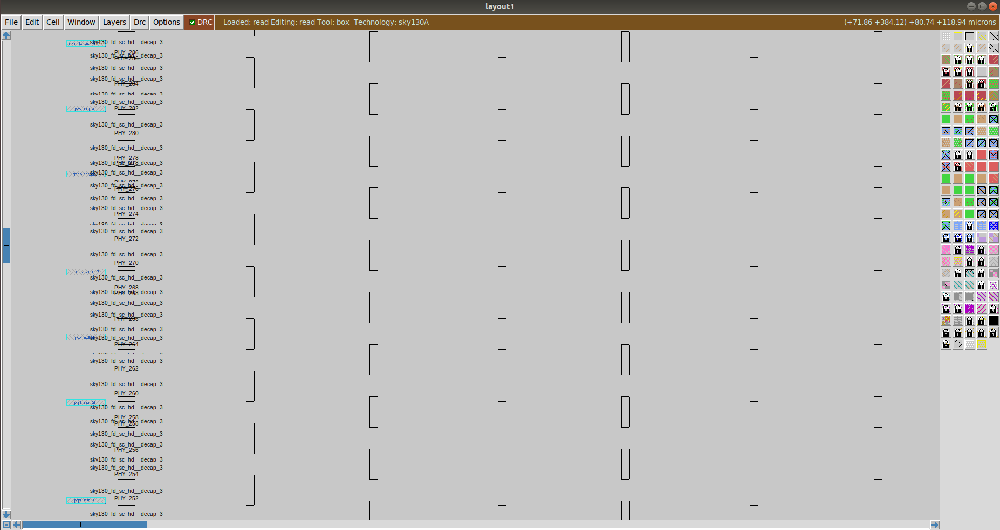
   
- Input and output pins are placed equidistantly.
- Metal layers are used for interconnections.
- Decap cells are arranged along the side rows for better power integrity.

2. **Pin Placement and Metal Layer Identification** To check the location of any pin and determine on which metal layer it is available:

   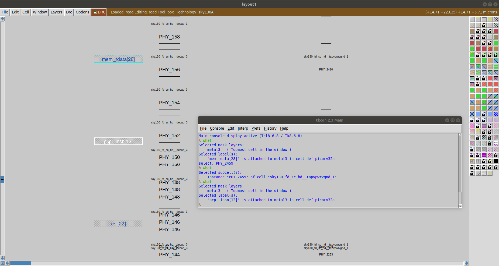
   
    1. Select the object by clicking on it and pressing `s`.
    2. To zoom in, click on the object and press `z`. To zoom out, press `Shift + z`.
    3. Open the `tkcon` window and type `what`. This command will display details about the selected pin.
    
    - By following this method:

        - Horizontal pins are identified to be on **Metal 3**.
        - Vertical pins are located on **Metal 2**.

3. **Decap Cell Arrangement**
   
    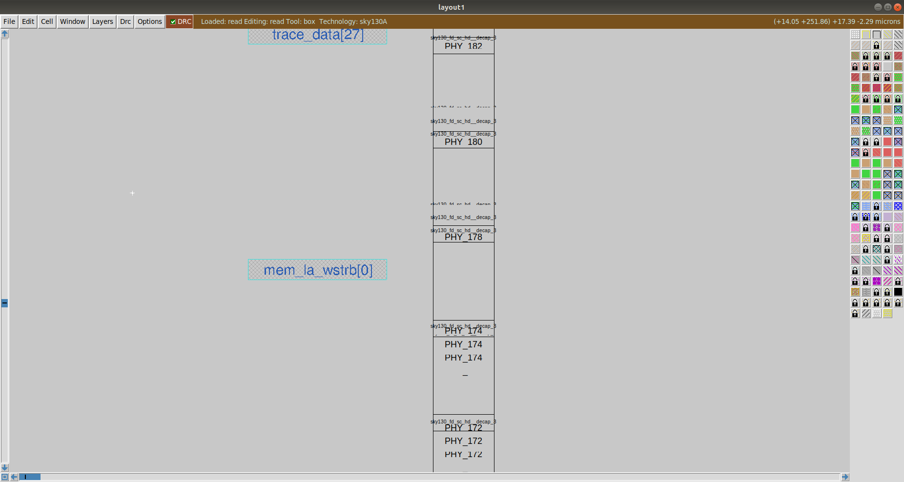
   
    Decap cells are strategically placed along the borders of the standard cell rows. These cells help in maintaining stable power distribution and reducing noise due to transient switching.

4. **Breakdown of Standard Cells**

    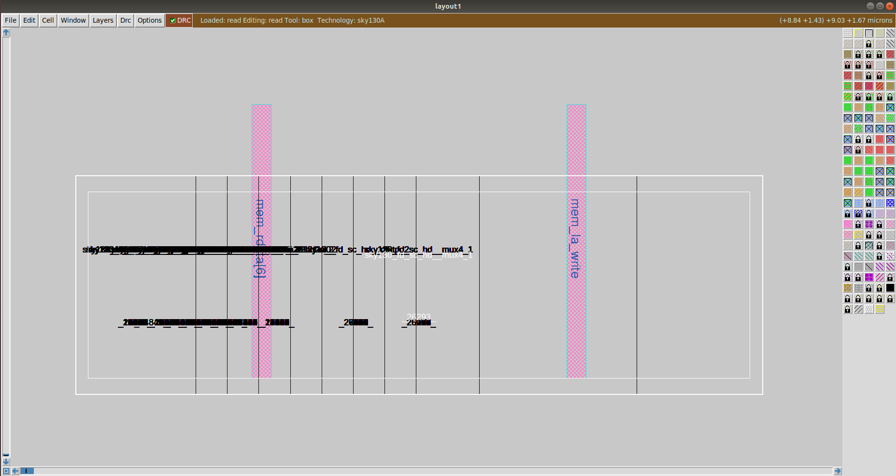

- The first standard cell in the block corresponds to **Buffer 1**.
- Similarly, subsequent cells correspond to **Buffer 2, AND gates, and other logic gates**.
- The complete block of standard cells forms the **4:1 MUX**.


####  Congestion aware placement using RePlAce

Placement in the ASIC flow is done in multiple stages to ensure an optimized layout for routing. It is primarily divided into:

1. **Global Placement** – The goal is to determine approximate locations for standard cells while optimizing wire length and reducing congestion.
2. **Legalization & Detailed Placement** – After global placement, cell locations are adjusted to ensure they align with the placement grid and obey design rules.

**Placement in OpenLANE**

In OpenLANE, placement is executed using the `run_placement` command. It follows a similar two-stage approach:

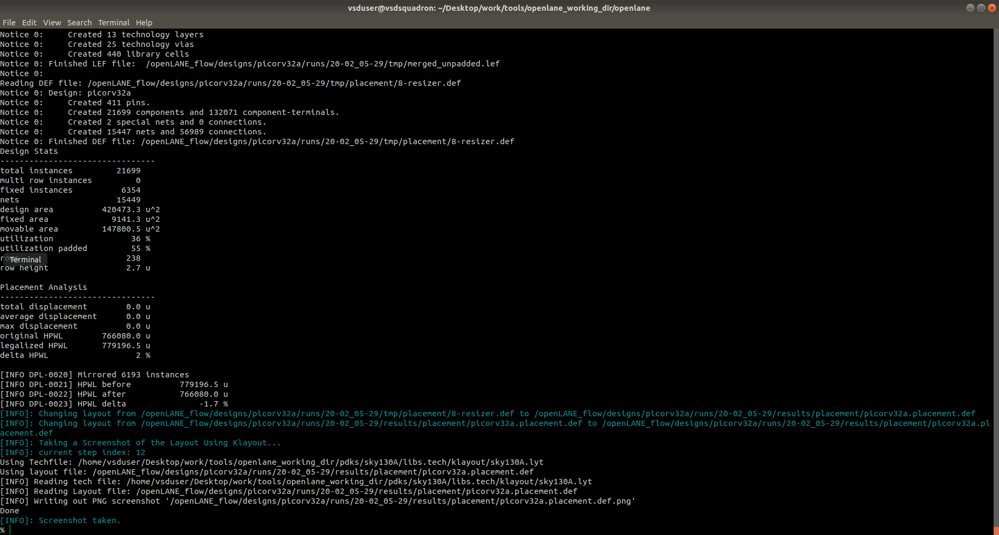
    
- **Global Placement**: The main objective is to reduce wire length and distribute cells efficiently. At this stage, legalization is not enforced.
- **Detailed Placement & Optimization**: After global placement, legalization is applied, ensuring all standard cells are placed correctly without overlap. Optimization steps focus on congestion minimization rather than timing constraints at this stage.

Once placement is completed, we can visualize the results using tools like **Magic** or **KLayout**. Below are the visualizations of the placement process:

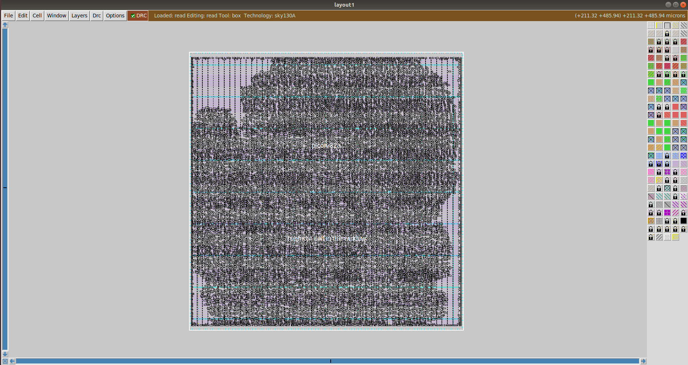

Zooming in on the placement layout reveals buffers, gates, flip-flops, multiplexers, and inverters.

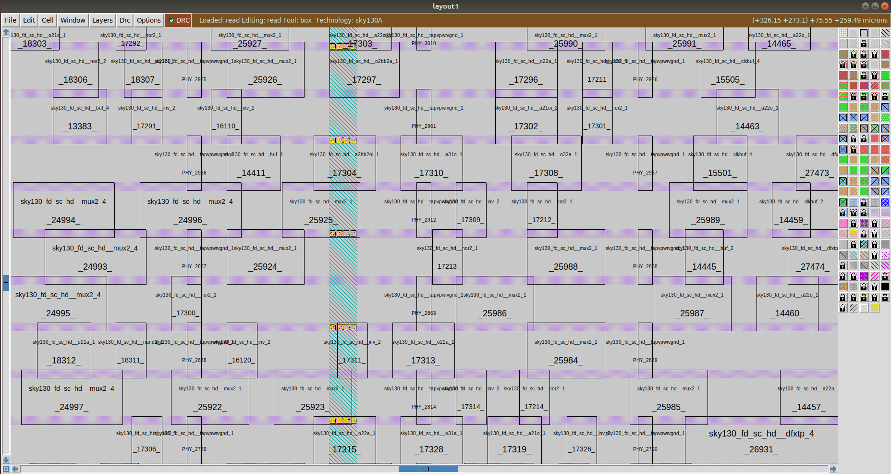

---

## Labs for CMOS inverter ngspice simulations

### IO placer revision

Floorplanning is a crucial step in the ASIC design flow. It involves defining the dimensions of the core and the standard cell placement. This document provides an overview of how to control pin placement during floorplanning using OpenLane.

1. **Default Pin Placement**

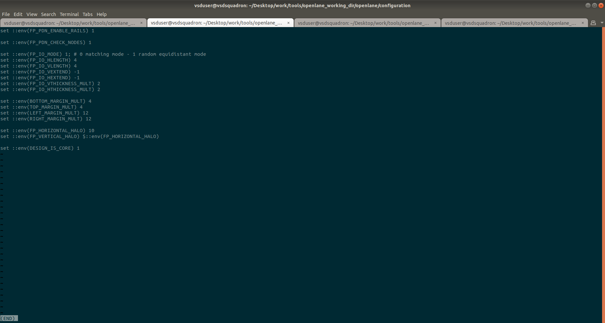

By default, OpenLane places pins at equal distances around the perimeter of the design. This behavior is controlled by the configuration variable:

```tcl
set ::env(FP_IO_MODE) 1
```

With this setting, the pins are evenly distributed around the core area.

2. **Modifying Pin Placement**

If you want to modify the default behavior, for example, by placing all the pins in the lower half of the core, you need to change the value of `FP_IO_MODE` in the floorplanning configuration file:

```tcl
set ::env(FP_IO_MODE) 2
```

This will instruct OpenLane to relocate the pins such that they are not evenly distributed but instead occupy specific regions.

3. **Running Floorplanning with Modified Pin Placement**

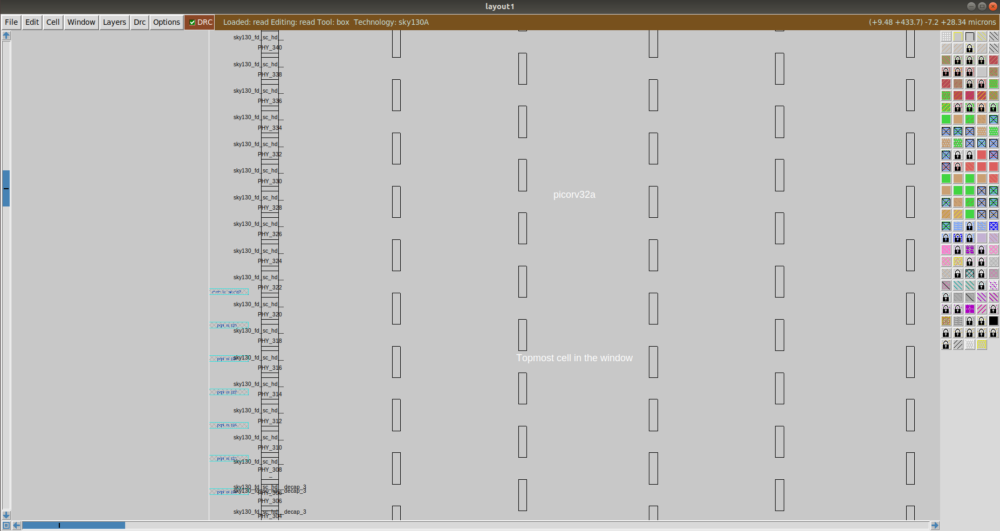
   
To apply the new pin placement, follow these steps:

1. Open the configuration file where `FP_IO_MODE` is defined.
2. Change its value from `1` to `2`.
3. Re-run the floorplanning step in OpenLane:
   ```sh
   run_floorplan
   ```
4. Verify the changes using `magic`:
   ```sh
   magic -T /home/vsduser/Desktop/work/tools/openlane_working_dir/pdks/sky130A/libs.tech/magic/sky130A.tech lef read ../../tmp/merged.lef def read picorv32a.floorplan.def &
   ```

4. **Observing the Changes**

    After making the changes and running the modified floorplanning, you can observe the new pin locations using `magic`.

    For example, in the modified layout, all pins are positioned in the lower half of the core, leaving the upper half empty.

    This approach provides flexibility in defining the pin locations based on design constraints and requirements.
   

### Lab steps to git clone vsdstdcelldesign

The **vsdstdcelldesign** repository contains standard cell designs used for ASIC design and OpenLane-based digital flows. This guide provides step-by-step instructions to clone and set up the repository within the OpenLane environment.

#### 1. Cloning the Repository**
Follow these steps to clone the repository and navigate into the project folder:

**Step 1: Open Terminal**
        Open a terminal window in your OpenLane working directory.

**Step 2: Clone the Repository**
    Run the following command to clone the `vsdstdcelldesign` repository from GitHub:

    ```bash
    git clone https://github.com/nickson-jose/vsdstdcelldesign.git
    ```
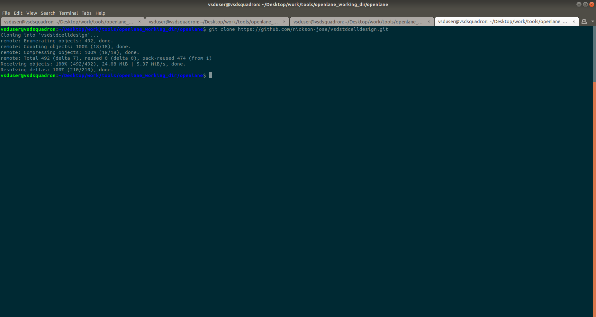
    
**Step 3: Verify the Cloned Repository**
    Once cloning is complete, list the contents of the OpenLane directory to confirm the repository has been cloned successfully:

    ```bash
    ls -ltr
    ```
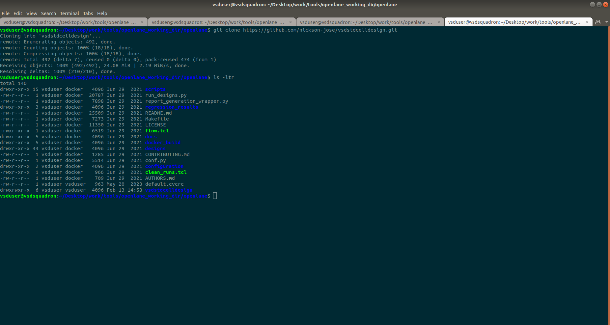

You should see a folder named `vsdstdcelldesign` inside the OpenLane directory.

**Step 4: Navigate into the Repository**
    Change into the newly cloned `vsdstdcelldesign` directory:

    ```bash
    cd vsdstdcelldesign
    ```
**Step 5: List the Files in the Repository**
    To check the contents of the cloned repository, run:

    ```bash
    ls -ltr
    ```

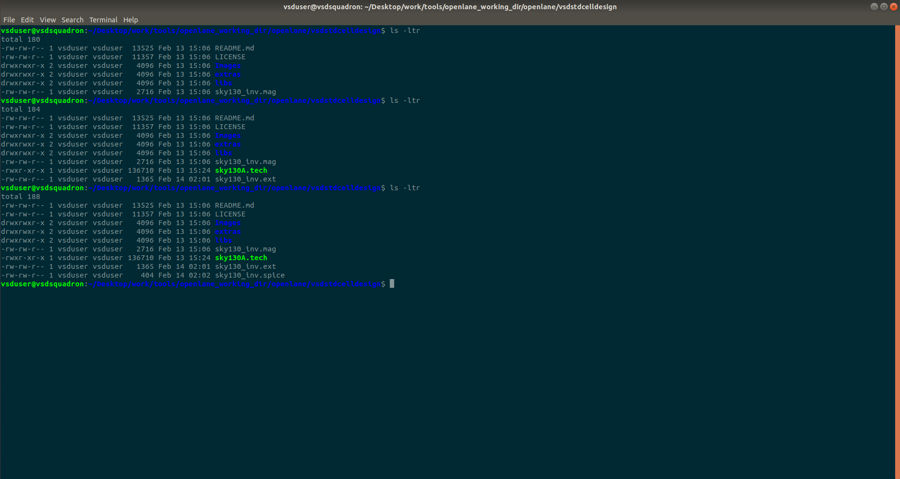

You should see various files and directories, including:
- **README.md** – Documentation file
- **libs/** – Contains standard cell libraries
- **images/** – Relevant design images
- **extra/** – Additional design files
- **sky130_inv.mag** – Magic layout file for the inverter design


#### 2. **Copy the Required Tech File**
Before opening the `.mag` file, we need to ensure that the required technology file (`sky130A.tech`) is available in the working directory. Follow these steps:

- Navigate to the `magic` directory where the tech file is stored:
  ```sh
  cd ~/Desktop/work/tools/openlane_working_dir/pdks/sky130A/libs.tech/magic/
  ```
- List the files to verify the presence of the `sky130A.tech` file:
  ```sh
  ls -ltr
  ```
- Copy the tech file to the required folder (`vsdstdcelldesign`):
  ```sh
  cp sky130A.tech ~/Desktop/work/tools/openlane_working_dir/openlane/vsdstdcelldesign
  ```
- Verify the copied file in the `vsdstdcelldesign` directory:
  ```sh
  cd ~/Desktop/work/tools/openlane_working_dir/openlane/vsdstdcelldesign
  ls -ltr
  ```
  
<p align="left">
    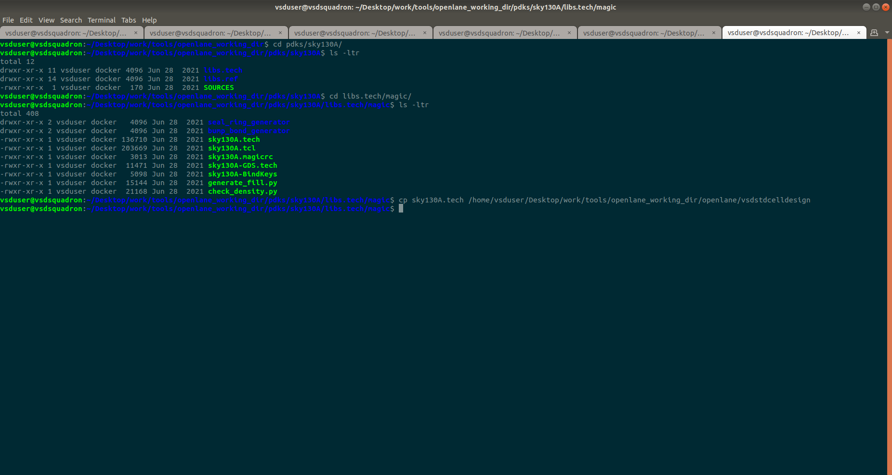
    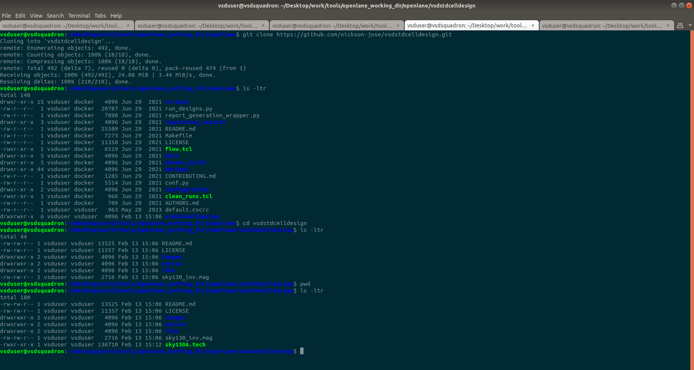
</p>


#### 3. **Open the .mag File in Magic Layout Editor**
With the `sky130A.tech` file in place, we can now open the `.mag` file in Magic:

- Open Magic from the terminal with the required tech file:
  ```sh
  magic -T sky130A.tech sky130_inv.mag
  ```
- This will open the layout of the inverter, allowing us to inspect the different layers used.

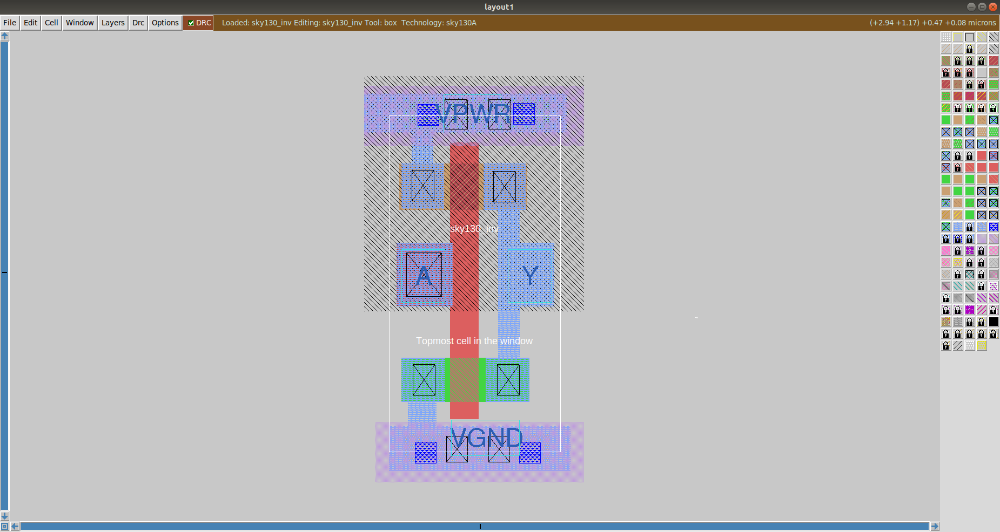

#### 4. **Analyze the Layers in Magic**
Once the layout is open, follow these steps to explore the layers used:

- Use the **Layers Panel** on the left side to enable or disable different layers.
- Identify key layers such as:
  - **Metal layers** (M1, M2, etc.)
  - **Poly** (used for gate formation)
  - **Diffusion** (active area for transistors)
  - **Contacts & Vias** (for interconnections)
- Verify the **transistor connections** forming the inverter logic.
- Use zoom (`z` key) and selection tools to inspect details.

#### 5. **Modify or Export the Layout**
If needed, you can make modifications and save the updated `.mag` file:

- To save changes:
  ```sh
  save sky130_inv.mag
  ```
- To export as GDSII:
  ```sh
  gds write sky130_inv.gds
  ```

### Lab Introduction to Sky130 Basic Layers Layout and LEF Using Inverter

This document provides an introduction to the Sky130 technology, focusing on the basic layers layout and the Layout Exchange Format (LEF) using an inverter design.

#### Layer Representation in Sky130

In Sky130, each color represents a different layer:

- **Local Interconnect**: Blue-purple
- **Metal 1**: Light purple
- **Metal 2**: Pink
- **N-Well**: Solid dashed line
- **N-Diffusion Region**: Green
- **P-Diffusion Region**: Brown
- **Polysilicon Gate**: Red

#### CMOS Inverter Layout
The provided layout represents a CMOS inverter using both NMOS and PMOS transistors. The identification of these components can be done using the `tkcon` console in the Magic layout tool.

#### Verification Process

<p align="left">
    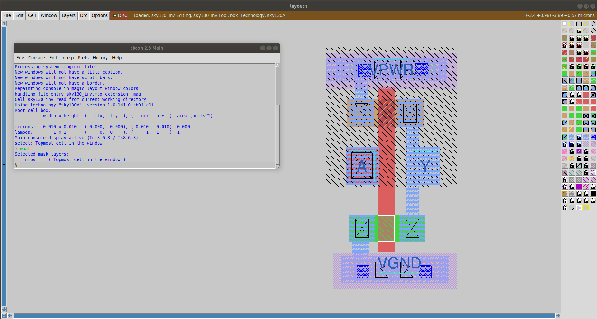
    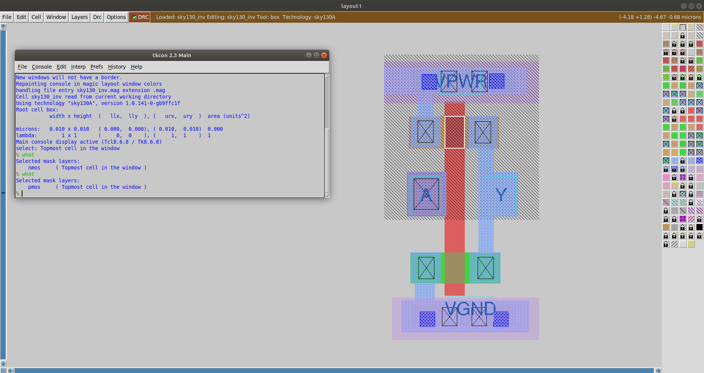
</p>

1. Open the inverter layout in Magic.
2. Use the `tkcon` terminal to check specific layers.
3. Enter `% what` to identify the selected mask layers.
4. If NMOS is selected, it will be displayed as `nmos (Topmost cell in the window)`.
5. Similarly, selecting PMOS will display `pmos (Topmost cell in the window)`.

#### Layout Connectivity Verification

This guide explains how to verify the connectivity of ports, metals, and contacts in a layout using a specific tool or software. Additionally, it covers how to check if the source of the PMOS is connected to the ground and how to perform a similar check for the NMOS.

#### Steps to Verify Connectivity

<p align="left">
    
    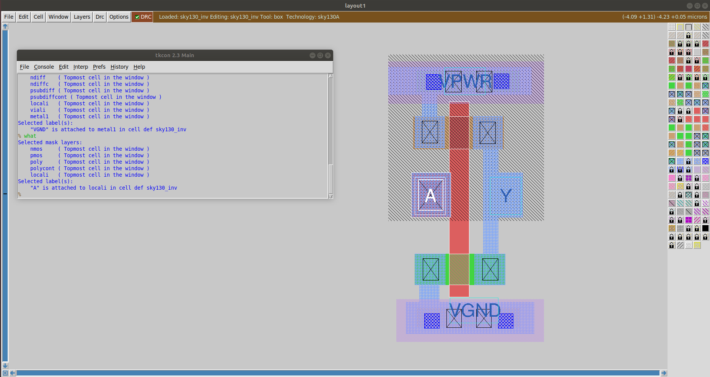
    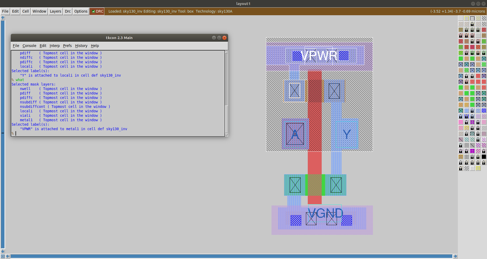
    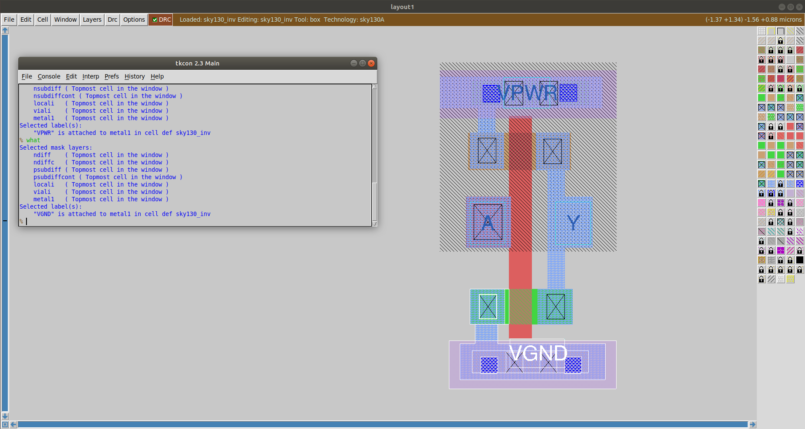
</p>
    
1. **Select the Region of Interest:**
   - Navigate to the layout and identify the region where you want to check the connectivity.
   - Double press the 'S' key on the same region to inspect the connectivity. This action will highlight the connected components and display relevant information.

2. **Check Attached Labels:**
   - Observe the labels attached to the components. For example, you might see that "Y" is attached to `locali` in the cell definition `sky130_inv`.


